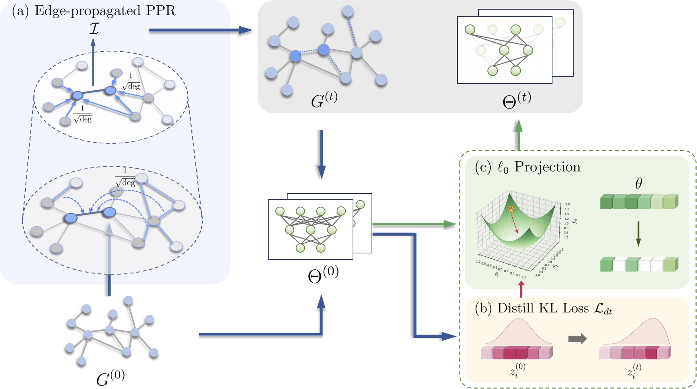

<div align="center">  

# TEDDY: Trimming Edges with Degree-based Graph Discrimination strategY

[](https://arxiv.org/abs/2402.01261)
[](https://iclr.cc/) 

</div>

Source code of our paper, [TEDDY: Trimming Edges with Degree-based Graph Discrimination strategY](https://arxiv.org/abs/2402.01261), accepted at ICLR 2024.




## Running the Code
- Create a virtual environment
```
sudo apt-get install python3-venv
python3 -m venv myvenv
source myvenv/bin/activate
```
- Install required packages
```
pip install torch==1.8.1+cu111 torchvision==0.9.1+cu111 torchaudio==0.8.1 -f https://download.pytorch.org/whl/torch_stable.html
pip install torch-scatter==2.0.8 torch-sparse==0.6.12 -f https://data.pyg.org/whl/torch-1.8.1+cu111.html
```
- Install following packages
```
pip install -r requirements.txt
```
- To reproduce the performance of Teddy on Citeseer (GIN), run the following script:
```
python main_teddy.py --dataset citeseer --net GIN --embedding_dim 512 --n_layers 2 --lr 0.01 --weight_decay 5e-4 --pruning_percent_adj 0.05 --pruning_percent_wei 0.1 --total_epoch 200 --distill_reg --lamb 10 
```
- To reproduce the performance of UGS on Citeseer (GIN), run the following script:
```
python main_baseline.py --dataset citeseer --type ugs --net GIN --embedding_dim 512 --n_layers 2 --lr 0.01 --weight_decay 5e-4 --pruning_percent_adj 0.05 --pruning_percent_wei 0.1 --total_epoch 200 --mask_epoch 200 --lamb_a 1e-6 --lamb_w 1e-5
```
- To reproduce the performance of WD-GLT on Citeseer (GIN), run the following script:
```
python main_baseline.py --dataset citeseer --type wasserstein --net GIN --embedding_dim 512 --n_layers 2 --lr 0.01 --weight_decay 5e-4 --pruning_percent_adj 0.05 --pruning_percent_wei 0.1 --total_epoch 200 --mask_epoch 200 --wasserstein_lamb 0.1 --max_iters 10
```
